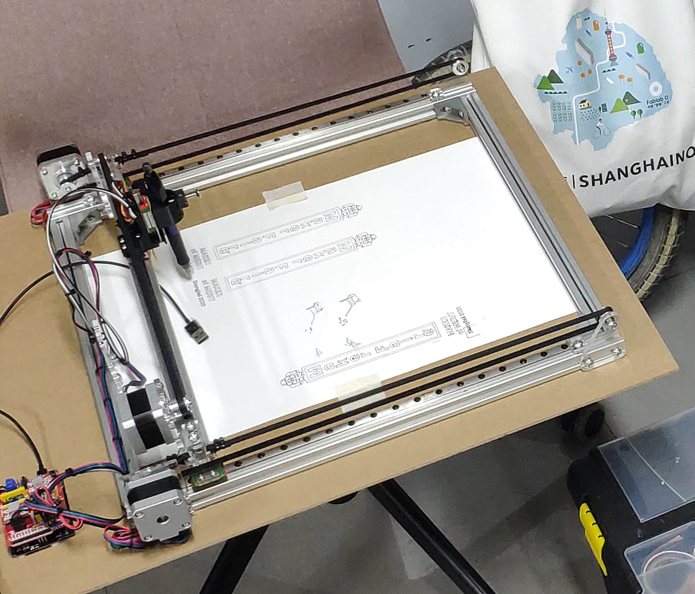
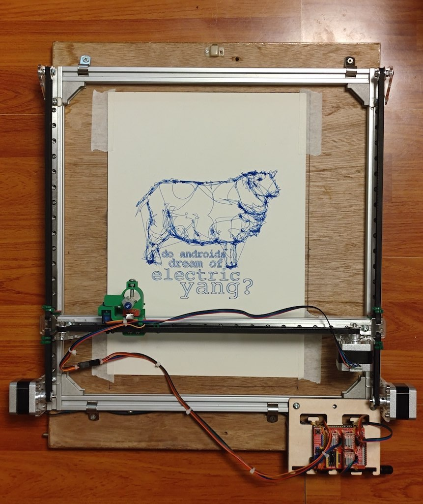

# Drawing Machine

This machine was designed in Fablab O Shanghai as an education project for a class called "Planet Art". The course's aim is to assemble the frame of the machine and re-design some of the structure starting from the provided design \(mainly for the laser cut plates and 3d printed accessories\) and use the machine to experience 2d/3d graphic original creations, self-expression through artwork, machine control electronics and software. After the assembly, test and familiarization with a working machine, students create artworks exploring the many possibilities of human-machine co-creation. The structure and parts of the machine is the result of many iterations and the sum of the improved design from instructors and students.

## Images

We are in the process of designing an assembly guide. Meanwhile you can refer to some images and videos to understand how the machine is assembled. Simple clue: the process is pretty easy and straightforward :\)

<video src="video-images/brush-drawing.mp4" width="600" controls></video>

## A little history

The  structure of the machine is based on a design by **Daniele Ingrassia @satsha** for a basic machine frame to be assembled in a short workshop he gave at the **STEAM Education International Symposium of Shanghai** in 2019 organised by Fablab O Shanghai and Tongji University College of Design and Innovation. His clever and simple structure using only 20x20 aluminum frames, angle joints, t-nuts, linear guides and two laser cut parts, became part of  Fablab O Shanghai inventory and Saverio Silli @saverio used it as the base for this drawing machine.

## Highlights of this design

The machine has some notable characteristics worth mentioning:

* it can be assembled by a couple of 10 years old in less than two hours
* the 3d printed parts can be printed while assembling the structure and are ready to use when the structure is assembled
* laser cutting takes less than 5 minutes
* only a few common tools are required to assemble the structure
* the size of the machine can be customised
* pen lift is virtually free of any wobbling and can accept several types of pens and other drawing media or be customised to accept different tools

[Find all the Design files in this page](design-files/README.md)

## Machine Control

Aside from the design of the machine structure, a thorough work has been done to polish and troubleshoot the code and workflow to ensure the software installation and operation to be as straightforward as possible. A modified GRBL for Servo library is provided, and several tips are listed covering the most common solutions for a successful operation.

[Find more info on the Electronic system in this page](electronic/README.md)

The machine uses an Arduino Uno with CNC Shield and A4988 Stepper drivers with GRBL for Servo firmware. We suggest to operate the machine through Inventables' Easel.

## Bill of Materials

[Find all the BOM in this page](design-files/Material List 2022.pdf)

The material list provides links on Taobao to buy the materials and a description about the materials. For more details you can check the taobao link.
